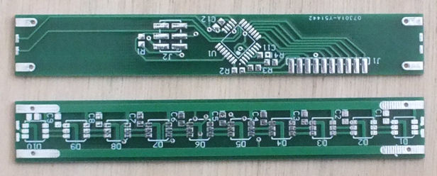
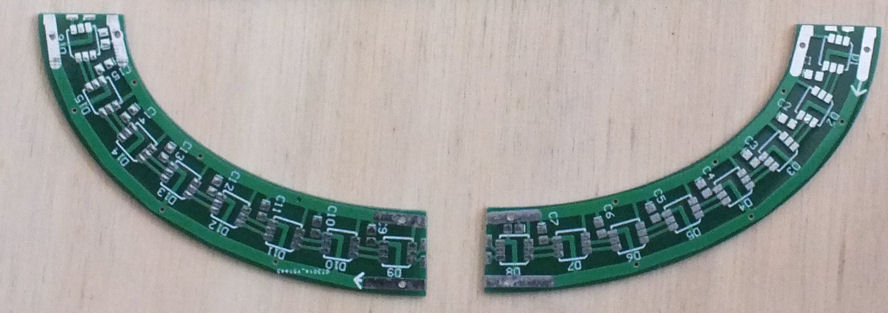
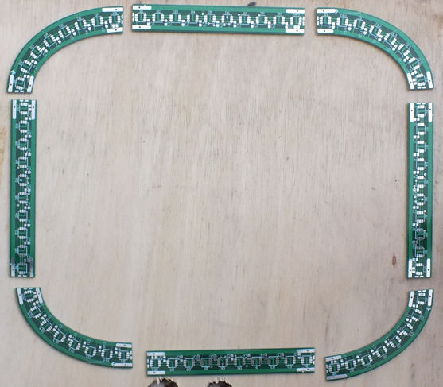
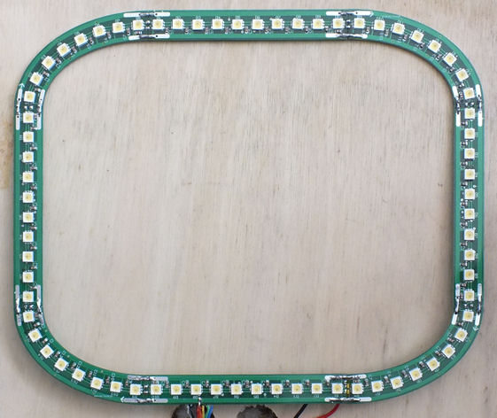

My magnifying lamping has an expensive, rectangular, flourescent light.  I promised next time it died, I'd replace it with an 
LED solution.

So here's my overengineered light, based on the AZIZ-light project at <a href="http://www.tangentaudio.com/2013/03/aziz-light/">Tangent Audio</a>

## Light bulb

The bulb in the lamp is a large rectangular shape, approximatelty 24cm x 20cm -
That is way too big ($$$) to make as a single board, so I split it up in to two parts - 
the curved corners, and the straight parts.

To keep it to 2 boards, I've kept the straight segments the same length and made the curved
corners asymetric.

The straight segments have the LED pattern on one side, and the microcontroller on the other.
To keep the routing simple, some of the pads for the microcontroller were ommited.

The curved segments only hold the LEDS; have a similar pattern on each side, but reveresed.  The arrow drawn 
in the overlay shows the communications direction of the LEDs.

The ends of the board have pads on the edge that are used to hold the assembly together using solder bridges.  
These are the 4 lines required by the LEDS; Vcc and GND on the outside, and Clk and Data on the inside.

The pieces are arranged to form the loop...

and then held together with solder bridgers, and small wire segments on the power lines.

## LEDS

I used individual APA102 type LEDs for the bulb (http://adafru.it/2351).  They are RGB LEDS, but have 3 white LEDs rather
than a Red, Green and Blue.  The interface has a Data and Clock line which can be driven directly via the SPI peripheral;
this means I don't have to worry about precision timing, and the microcontroller can use its internal RC oscillator.

There are 72 LEDs.  They draw about 50mA each at full brightness, so about 3.5A total.

## Microcontroller

I used a ATMEGA48A, because I had one on hand.  As described above, I use the internal RC oscillator to run it at ~8MHz, and the 
SPI to drive the LEDs.

An RGB rotary encoder (https://www.sparkfun.com/products/10982) is used to switch modes and adjust settings.

The power is switched by the lamp's original switch.  The whole circuit draws about 90mA in standby, so a soft switch would be inefficient.

## Schematics

The schematics are in the schematics folder.  Beware - for some reason the MCU schematic doesn't match the board very well.  
The encoder pinouts don't match.  Although the crystal wasn't used, it is still there with resistors rather than capacitors to ground.
And I think the ISP is all wrong.  A bad day.

## Source

The source is an Atmel Studio 7.0 project - a single main.cpp as it was a relatively simple application.

The interface is as follows...

Pressing the button on the encoder moves to the next mode.

<table>
<tr>
<th>Mode</th><th>Encoder Function</th><th>Press and Hold 1 Sec</th><th>Press and Hold 2 Sec</th>
</tr>
<tr>
<td>All LEDs On</td><td>Adjust brightness</td><td></td><td></td>
</tr>
<tr><td>1 segment</td><td>Adjust brightness</td><td>Rotate the position of the segment</td><td>Change the size of the segment</td></tr>
<tr><td>2 segments</td><td>Adjust brightness</td><td>Rotate the position of the segment</td><td>Change the size of the segment</td></tr>
<tr><td>3 segments</td><td>Adjust brightness</td><td>Rotate the position of the segment</td><td>Change the size of the segment</td></tr>
<tr><td>4 segments</td><td>Adjust brightness</td><td>Rotate the position of the segment</td><td>Change the size of the segment</td></tr>
</table>
